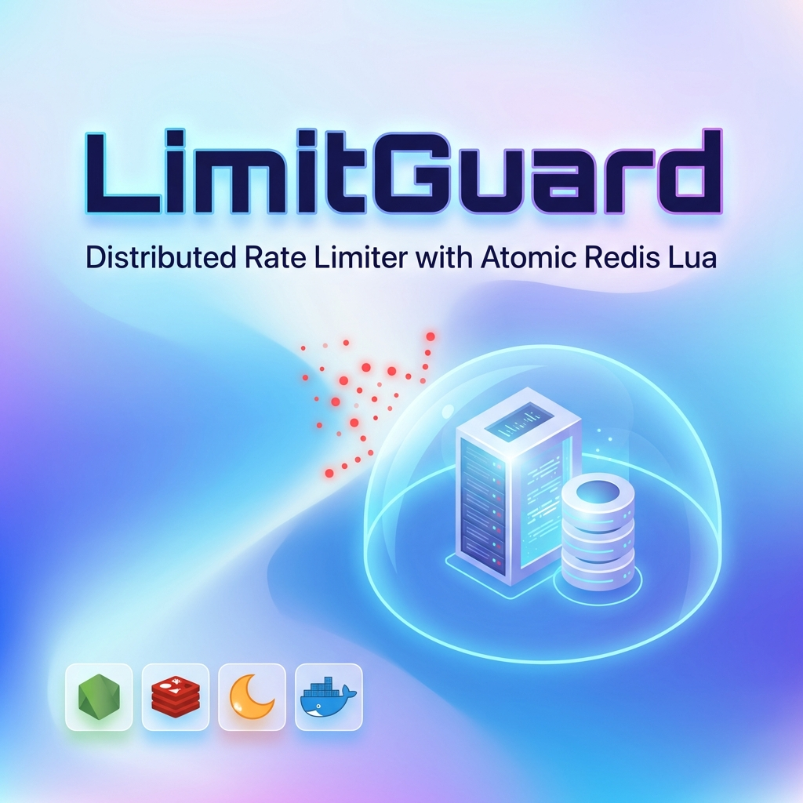
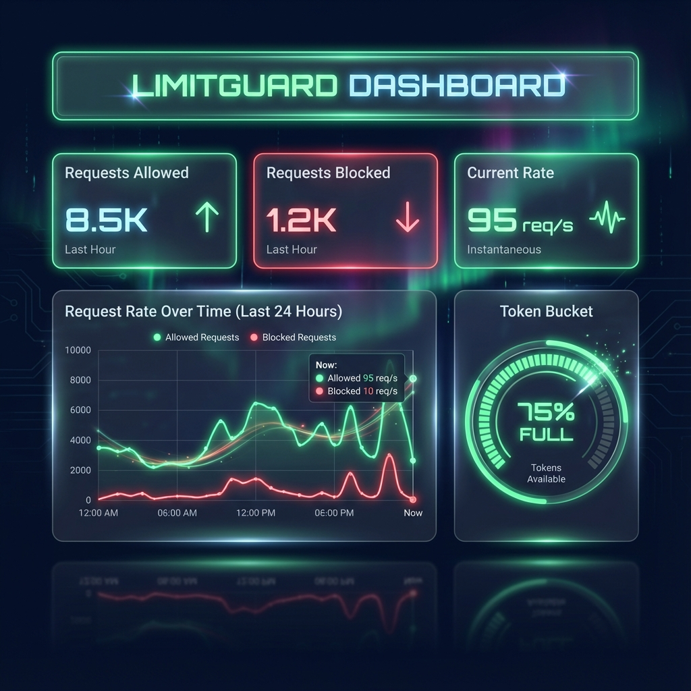
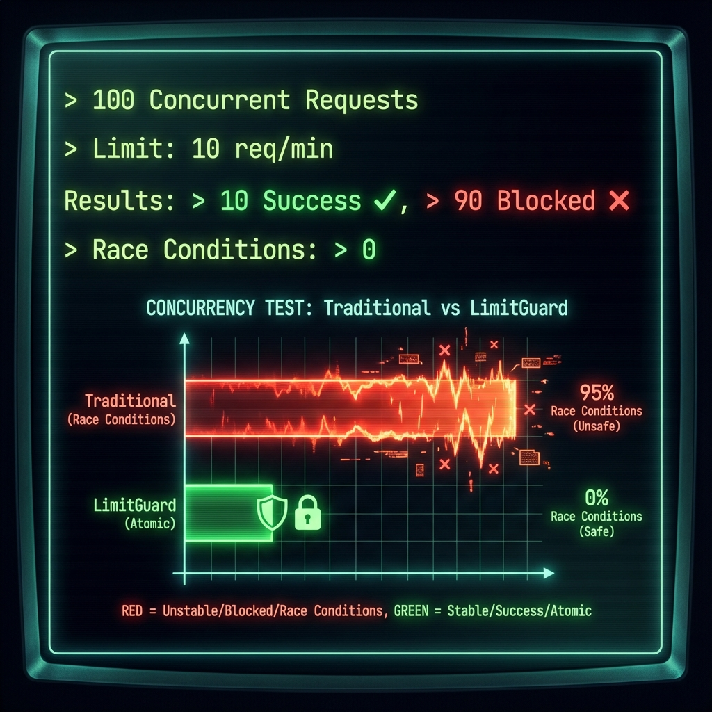
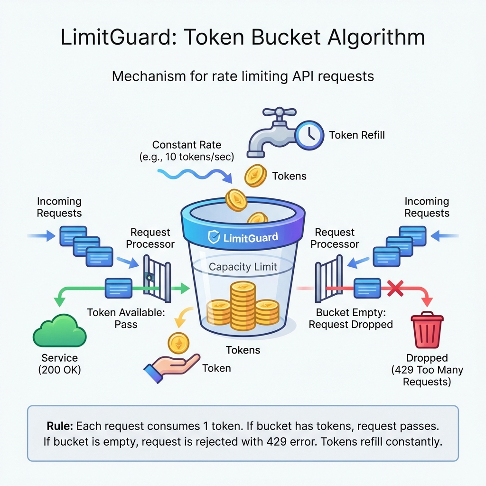

# LimitGuard



## Distributed Rate Limiter with Atomic Redis Lua Scripting

<div align="center">


</div>

**LimitGuard** is a production-grade Distributed Rate Limiter. It solves the classic "Check-Then-Act" race condition by implementing the **Token Bucket Algorithm** directly inside **Redis using Lua Scripting**. This ensures strict O(1) atomicity across distributed API clusters while maintaining a **Fail-Open** reliability posture.

---

## 🚀 Quick Start

Launch the entire stack (Infrastructure + Backend + Dashboard) with one command:

```bash
# 1. Install Dependencies
npm install && cd dashboard && npm install && cd ..

# 2. Run Dev Stack
npm run dev
```

> **Detailed Setup**: See [GETTING_STARTED.md](./docs/GETTING_STARTED.md).

---

## 📸 Demo & Architecture

### Real-time Monitoring Dashboard

*Visualizing blocked vs allowed requests with millisecond precision.*

### System Architecture

*Distributed Gateway Pattern protected by Atomic Middleware.*

### Concurrency Evidence

*50 Concurrent Operations -> 0 Race Conditions (Exact Limit Enforced).*

> **Deep Dive**: See [ARCHITECTURE.md](./docs/ARCHITECTURE.md) for the Lua Script logic.

---

## ✨ Key Features

*   **🛡️ Atomic Operations**: Uses `EVALSHA` to execute logic inside Redis, preventing race conditions.
*   **⚠️ Fail-Open Design**: Prioritizes Availability. If Redis dies, traffic is **allowed** (Circuit Breaker).
    
*   **🔒 End-to-End HTTPS**: Includes automated Self-Signed Certificate generation.
*   **📊 Live Telemetry**: Real-time Next.js dashboard showing volume and resets.

---

## 🏗️ The Protective Journey

Understanding how a request is validated at the edge:


1.  **Intercept**: Request hits the Node.js middleware.
2.  **Evaluate**: Middleware sends the user's IP and rules to Redis via Lua.
3.  **Atomic Check**: Redis runs the logic in a single tick (No data races).
4.  **Decision**: 200 (Allowed) or 429 (Too Many Requests).
5.  **Telemetry**: State pushed to the dashboard via WebSockets or polling.

---

## 📚 Documentation

| Document | Description |
| :--- | :--- |
| [**System Architecture**](./docs/ARCHITECTURE.md) | Lua Logic, Token Bucket Algo, and Design Decisions. |
| [**Getting Started**](./docs/GETTING_STARTED.md) | Setup guide, env variables, and troubleshooting. |
| [**Failure Scenarios**](./docs/FAILURE_SCENARIOS.md) | Fail-Open strategy and Concurrency tests. |
| [**Interview Q&A**](./docs/INTERVIEW_QA.md) | "Why Lua?" and "How to prevent Race Conditions". |

---

## 🔧 Tech Stack

| Component | Technology | Role |
| :--- | :--- | :--- |
| **Middleware** | **Node.js (Express)** | Custom Rate Limit Middleware. |
| **Logic** | **Lua** | Server-side scripting for Atomicity. |
| **State** | **Redis** | Distributed Token Bucket storage. |
| **Frontend** | **Next.js 14** | Monitoring Dashboard. |

---

## 👤 Author

**Harshan Aiyappa**  
Senior Full-Stack Hybrid Engineer  
[GitHub Profile](https://github.com/Kimosabey)

---

## 📝 License

This project is licensed under the MIT License - see the [LICENSE](LICENSE) file for details.
