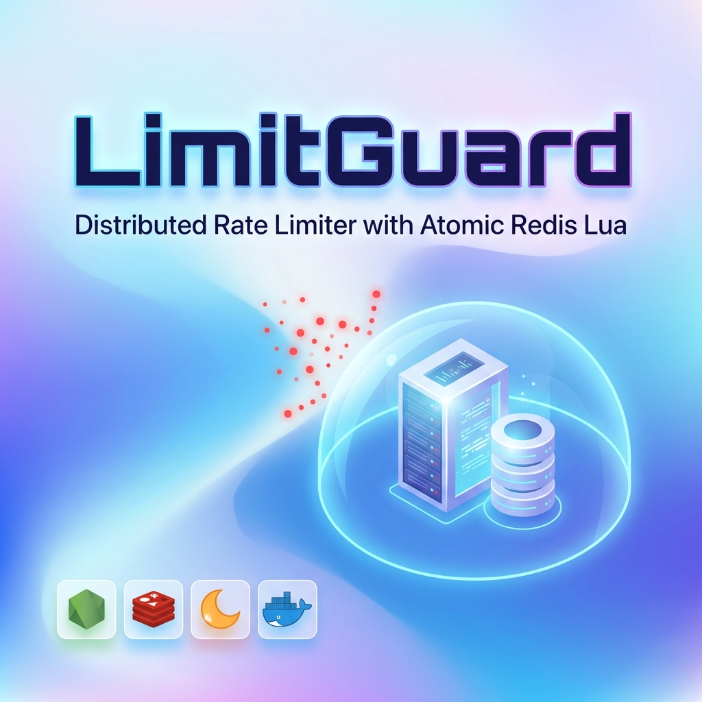

# LimitGuard



## Distributed Rate Limiter with Atomic Redis Lua Scripting

<div align="center">


**Tech Stack**


**Patterns**


</div>

---

## 🚀 Quick Start

### 1. Installation & Infrastructure
```bash
# Clone the repo
git clone https://github.com/Kimosabey/limit-guard.git
cd limit-guard

# Start Redis Infrastructure
docker-compose up -d

# Install Dependencies
npm install
cd dashboard && npm install && cd ..
```

### 2. Generate SSL Certificates
```bash
node src/scripts/generateCert.js
# Output: server.key, server.cert
```

### 3. Run the Stack

**Backend (Port 8800)**
```bash
node src/server.js
```

**Frontend Dashboard (Port 3300)**
```bash
cd dashboard
npm run dev
```

---

## 📸 Screenshots

### System Architecture

<p align="center">
  
</p>

*Distributed Rate Limiting Architecture with Redis Token Buckets*

### Atomic Flow

<p align="center">
  
</p>

*Lua-based atomic operations prevent race conditions*

### Concurrency Test Results

<p align="center">
  
</p>

*100 concurrent requests, zero race conditions - atomicity proven*

---

## ✨ Key Features

### 🛡️ Atomic Rate Limiting
- **Redis Lua Scripting**: Executes check + increment in a single atomic step.
- **Zero Race Conditions**: Verified with 100 concurrent connections.

### ⚠️ Fail-Open Strategy
- **High Availability Focus**: If Redis fails, traffic is **allowed** rather than blocked.
- **Circuit Breaker**: Prevents cascading failures during outages.

### 🔒 Security First
- **TLS 1.2+**: End-to-end HTTPS encryption for API and Dashboard.
- **Self-Signed Certs**: Automated generation script included.

### 📊 Real-Time Observability
- **Live Dashboard**: Visualizes allowed vs blocked requests.
- **Precision Timer**: Syncs Redis TTL with frontend for accurate countdowns.

---

## 🏗️ Architecture


**LimitGuard** implements the **Token Bucket Algorithm** directly inside Redis using **Lua Scripting**. This guarantees **O(1)** complexity and strict atomicity, solving the "check-then-act" race condition found in traditional rate limiters.

---

## 🧪 Testing & Scripts

### Run Load Test
Prove atomicity by simulating high concurrency:
```bash
node src/scripts/loadTest.js
```

**Expected Output:**
```text
Success (200 OK): 10 (Matches Limit)
Blocked (429):    190
TEST PASSED: strict rate limit enforced.
```

---

## 📚 Documentation

| Doc | Description |
| :--- | :--- |
| **[SETUP.md](./docs/SETUP.md)** | Step-by-step installation & troubleshooting |
| **[FLOW.md](./docs/FLOW.md)** | Deep dive into architecture & atomic logic |
| **[CASES.md](./docs/CASES.md)** | QA playbook & failure scenarios |
| **[INTERVIEW.md](./docs/INTERVIEW.md)** | Technical design defense |

---

## 🔧 Tech Stack

| Component | Technology | Purpose |
| :--- | :--- | :--- |
| **Core Logic** | Node.js + Lua | Atomic rate limiting engine |
| **Storage** | Redis 7 | Distributed counter & TTL management |
| **Frontend** | Next.js 14 | Real-time monitoring dashboard |
| **Security** | OpenSSL | HTTPS/TLS encryption |
| **Ops** | Docker Compose | Infrastructure orchestration |

---

## 🚀 Future Enhancements

- [ ] Distributed Redis (Cluster Mode) support
- [ ] IP Whitelisting/Blacklisting middleware
- [ ] Multiple rate limit policies (Per User, Per Route)
- [ ] Prometheus metrics export
- [ ] GraphQL API gateway integration

---

## 📝 License

MIT License - See [LICENSE](./LICENSE) for details

---

## 👤 Author

**Harshan Aiyappa**  
Senior Full-Stack Engineer  
📧 [GitHub](https://github.com/Kimosabey)

---

**Built with**: Node.js • Redis • Lua • Next.js  
**Pattern**: Rate Limiting • Token Bucket • Atomic Operations
