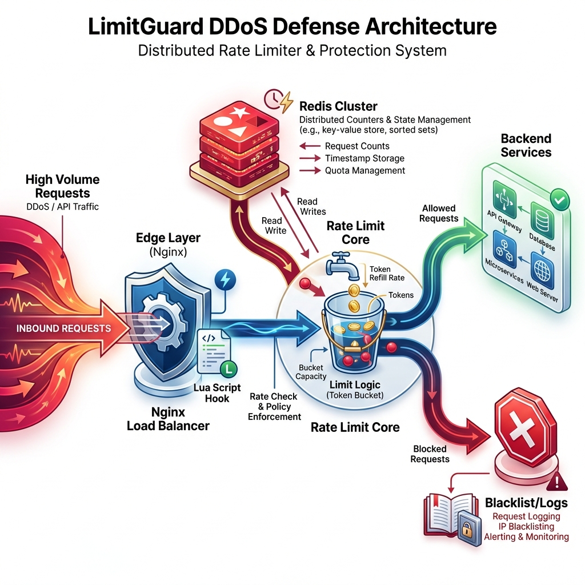

# 🏗️ System Architecture: LimitGuard

## 1. High-Level Design (HLD)

LimitGuard implements a **Distributed Gateway Pattern** to protect APIs from abuse. It sits as a middleware layer, intercepting every request to verify traffic volume against a centralized counter before allowing it to proceed to the controller logic.



```mermaid
graph TD
    User([User / Attacker]) -->|HTTPS| LB[Node.js Gateway]
    LB -->|1. Request Intercept| Middleware[LimitGuard Middleware]
    
    subgraph "Atomic Verification"
        Middleware -->|2. EVALSHA| Redis[(Redis AOF)]
        Redis -->|3. Lua Script| Logic{Check & Incr}
    end
    
    Logic -- Allowed --> Middleware
    Logic -- Blocked --> Middleware
    
    Middleware -->|4a. Allowed (200)| Controller[API Logic]
    Middleware -->|4b. Blocked (429)| Response[Error Response]
```

### Core Components
1.  **Node.js Gateway (Express)**: The API server running the middleware.
2.  **Redis (The Brain)**: Stores the centralized state (Token Buckets). Uses **AOF Persistence** for durability.
3.  **Lua Script**: Executes the core logic atomically on the Redis server to prevent race conditions.
4.  **Dashboard (Next.js)**: Observability tool to visualize traffic spikes and blocked requests.

---

## 2. Low-Level Design (LLD)

### The Atomic Lua Script
To prevent **Race Conditions** (TOCTOU - Time Of Check to Time Of Use), we execute the "Check-then-Increment" logic inside Redis.

**The Algorithm**:
```lua
-- KEYS[1]: Unique User ID (IP Address)
-- ARGV[1]: Window Size (e.g., 60 seconds)
-- ARGV[2]: Request Limit (e.g., 10 requests)

local current = redis.call("INCR", KEYS[1])
local ttl = redis.call("TTL", KEYS[1])

if current == 1 then
    -- First request: Set the Expiry Window
    redis.call("EXPIRE", KEYS[1], ARGV[1])
    ttl = ARGV[1]
end

local allowed = (current <= tonumber(ARGV[2])) and 1 or 0
return { allowed, current, ttl }
```

### Data Schema (Redis)
*   **Key**: `rate_limit:<ip_address>` (e.g., `rate_limit:192.168.1.5`)
*   **Value**: Integer (Counter)
*   **TTL**: Seconds remaining in the window.

---

## 3. Decision Log

| Decision | Alternative | Reason for Choice |
| :--- | :--- | :--- |
| **Lua Scripting** | Node.js Transaction (`MULTI`/`EXEC`) | **Performance & Atomicity**. Lua avoids network round-trips for the lock and provides stricter atomicity than optimistic locking in client libraries. |
| **Redis** | In-Memory (`Map`) | **Scalability**. In-Memory maps only work for a single server. Redis allows the rate limit to be shared across a cluster of 100+ API servers. |
| **Fail-Open** | Fail-Closed | **Availability**. If the rate limiter (Redis) dies, we prefer to risk some spam rather than taking down the entire API (Availability > Consistency). |

---

## 4. Key Patterns

### The "Fail-Open" Circuit Breaker
If Redis times out or throws an error, the middleware catches the exception, logs it, and **allows** the request.
This ensures that the Rate Limiter never becomes a Single Point of Failure (SPOF).

### Token Bucket (Simplified)
We use a Fixed Window counter implementation which behaves similarly to a Token Bucket for simple use cases. It resets fully after `N` seconds, guaranteeing a hard cap on load.
